```mermaid
graph TB
    subgraph "Video Input Processing"
        A[Video File<br/>MP4, AVI, etc.] --> B[Frame Extraction<br/>FFmpeg/OpenCV]
        B --> C[Frame Cropping<br/>Face Detection]
        C --> D[Frame Preprocessing<br/>Resize, Normalize]
    end
    
    subgraph "Feature Extraction"
        D --> E[EfficientNet Encoder<br/>B0 or B7]
        E --> F[Feature Maps<br/>Spatial Features]
        F --> G[Global Average Pooling<br/>1×1×Feature_Dim]
    end
    
    subgraph "Classification"
        G --> H[Fully Connected Layers<br/>Dropout 0.5]
        H --> I[Sigmoid Activation<br/>Binary Classification]
        I --> J[Per-Frame Probability<br/>0.0 = Real, 1.0 = Fake]
    end
    
    subgraph "Video-Level Aggregation"
        J --> K[Frame Statistics<br/>Count fake frames]
        K --> L[Threshold Strategy<br/>fake_fraction ≥ 0.10]
        L --> M[Video Classification<br/>Real or Fake]
    end
    
    style A fill:#e1f5ff
    style E fill:#fff4e1
    style I fill:#ffe1f5
    style M fill:#e1ffe1
```

```mermaid
graph TB
    subgraph "Audio Input Processing"
        A[Audio File<br/>WAV, MP3, etc.] --> B[Audio Preprocessing<br/>Resample, Normalize]
        B --> C[Frame Segmentation<br/>Overlapping windows]
        C --> D[Feature Extraction<br/>Spectrogram/MFCC]
    end
    
    subgraph "Spectrogram Analysis"
        D --> E[Short-Time FFT<br/>STFT]
        E --> F[Mel Spectrogram<br/>Frequency → Mel Scale]
        F --> G[Log Mel Spectrogram<br/>Log scaling]
    end
    
    subgraph "Deep Learning Classification"
        G --> H[CNN Encoder<br/>2D Convolutions]
        H --> I[Feature Maps<br/>Temporal + Frequency]
        I --> J[Global Pooling<br/>Temporal aggregation]
        J --> K[Fully Connected Layers]
        K --> L[Sigmoid Activation<br/>Binary Classification]
    end
    
    subgraph "Audio-Level Aggregation"
        L --> M[Segment Predictions<br/>Per-window scores]
        M --> N[Voting Strategy<br/>Majority vote]
        N --> O[Audio Classification<br/>Real or Fake]
    end
    
    style A fill:#e1f5ff
    style F fill:#fff4e1
    style H fill:#ffe1f5
    style O fill:#e1ffe1
```

<div align="center">

# 🔍 Alethia: All-in-One Deepfake Detection System

### *Comprehensive Multi-Modal AI Authenticity Verification Platform*

[](https://www.python.org/)
[](https://pytorch.org/)
[](LICENSE)

**Unifying Image, Text, Audio, and Video Deepfake Detection in a Single, Powerful Framework**

---

</div>

---

## 📋 Table of Contents

- [What is Alethia?](#-what-is-alethia)
- [System Overview](#-system-overview)
- [Video Deepfake Detection](#-video-deepfake-detection)
- [Audio Deepfake Detection](#-audio-deepfake-detection)
- [Unified Architecture](#-unified-architecture)
- [Installation & Setup](#-installation--setup)
- [Usage Guide](#-usage-guide)
- [Performance Metrics](#-performance-metrics)
- [Resources & Documentation](#-resources--documentation)
- [Contributing](#-contributing)
- [License](#-license)

---

## 🎯 What is Alethia?

**Alethia** (ἀλήθεια) is an **all-in-one deepfake detection system** that provides comprehensive authenticity verification across multiple media modalities. Named after the ancient Greek word for "truth," Alethia represents a unified approach to combating digital deception in the modern age.

### The Alethia Ecosystem

Alethia consists of **four specialized detection modules**, each optimized for a specific media type:

1. **🖼️ Image Deepfake Detection** - Face manipulation detection in static images
2. **📝 Text Deepfake Detection** - AI-generated content detection in text
3. **🎬 Video Deepfake Detection** - Temporal deepfake detection in video sequences
4. **🎵 Audio Deepfake Detection** - Voice cloning and audio manipulation detection

### Why Alethia?

In today's digital landscape, deepfakes manifest across **all media types**:

- **Images**: Face-swapped photos, manipulated portraits
- **Text**: AI-generated articles, ChatGPT-written content
- **Videos**: Face-swapped videos, lip-sync manipulations
- **Audio**: Voice cloning, synthetic speech

**Alethia** provides a **unified solution** that:
- ✅ Detects deepfakes across all media modalities
- ✅ Uses state-of-the-art deep learning architectures
- ✅ Provides consistent APIs and interfaces
- ✅ Enables multi-modal analysis for comprehensive verification

---

## 🏗️ System Overview

### High-Level Architecture


### Module Comparison

| Module | Input Type | Primary Model | Detection Method | Accuracy |
|--------|-----------|---------------|------------------|----------|
| **Image** | Static Images | EfficientNet-B4 + Attention | Face extraction → Classification | ~90% |
| **Text** | Text Documents | GPT-2 + MultinomialNB | Perplexity + Burstiness | ~95% |
| **Video** | Video Sequences | EfficientNet-B7 | Frame-by-frame analysis | ~85-90% |
| **Audio** | Audio Files | CNN + Spectrogram | Frequency domain analysis | ~85-90% |

---

## 🎬 Video Deepfake Detection

### Overview

The **Video Deepfake Detection** module analyzes video sequences frame-by-frame to identify temporal inconsistencies and manipulation artifacts. It uses a sophisticated pipeline that extracts frames, processes them through a deep learning encoder, and aggregates predictions across the entire video.

### Architecture



### Detailed Component Architecture


### Model Architecture Details

#### Encoder Options

**EfficientNet-B0** (Lightweight):
- **Input Size**: 224×224 pixels
- **Feature Dimension**: 1,280
- **Parameters**: ~5.3M
- **Use Case**: Fast inference, real-time detection

**EfficientNet-B7** (High Accuracy):
- **Input Size**: 600×600 pixels
- **Feature Dimension**: 2,560
- **Parameters**: ~66M
- **Use Case**: Maximum accuracy, batch processing

#### Classification Head

```python
# Architecture
Input: Feature vector (1280 or 2560 dims)
↓
Linear(Feature_Dim → 10% Feature_Dim)
↓
Dropout(0.5)
↓
ReLU
↓
Linear(10% Feature_Dim → 1)
↓
Sigmoid
↓
Output: Probability [0.0, 1.0]
```

### Detection Pipeline

#### Step 1: Frame Extraction

```python
# Process
1. Load video file
2. Extract frames at specified FPS (e.g., 1 frame/second)
3. Detect and crop faces from each frame
4. Resize frames to model input size (224×224 or 600×600)
5. Normalize pixel values [0, 255] → [0, 1]
```

#### Step 2: Per-Frame Classification

```python
# For each frame:
1. Forward pass through EfficientNet encoder
2. Extract feature maps
3. Global average pooling → feature vector
4. Classification head → probability score
5. Store: frame_id, probability, prediction
```

#### Step 3: Video-Level Aggregation

**Strategy**: If at least `fake_fraction` (default: 10%) of frames are classified as fake with probability above threshold, the entire video is labeled as fake.

```python
# Aggregation Logic
def classify_video(frames, prob_threshold=0.50, fake_fraction=0.10):
    fake_frames = [f for f in frames if f.probability > prob_threshold and f.prediction == 1]
    total_frames = len(frames)
    
    if len(fake_frames) >= (fake_fraction * total_frames):
        return "Fake"
    else:
        return "Real"
```

### Training Pipeline


### Key Features

✨ **Frame-by-Frame Analysis**: Detects subtle artifacts in individual frames  
🚀 **Temporal Aggregation**: Combines frame-level predictions for video classification  
📊 **Adaptive Thresholding**: Grid search for optimal detection parameters  
🎯 **High Accuracy**: 85-90% accuracy on DFDC dataset  
⚡ **Flexible Encoders**: Choose between B0 (fast) or B7 (accurate)  
📈 **Comprehensive Logging**: Detailed metrics and visualizations  

### Detection Artifacts

The model learns to detect various deepfake artifacts:

1. **Face Boundary Artifacts**: Blurring or inconsistencies at face edges
2. **Eye Inconsistencies**: Unnatural eye movements or reflections
3. **Skin Texture**: Smoothing or unnatural skin patterns
4. **Hair Details**: Artifacts in hair boundaries
5. **Lighting Inconsistencies**: Mismatched lighting between face and background
6. **Temporal Flickering**: Frame-to-frame inconsistencies

---

## 🎵 Audio Deepfake Detection

### Overview

The **Audio Deepfake Detection** module identifies synthetic speech, voice cloning, and audio manipulation. It analyzes audio signals in the frequency domain using spectrogram analysis and deep learning models to detect artifacts left by voice synthesis systems.

### Architecture



### Detailed Component Architecture

```mermaid
graph LR
    subgraph "Spectrogram Generation"
        A1[Raw Audio<br/>16kHz, Mono] --> A2[Windowing<br/>25ms windows, 10ms hop]
        A2 --> A3[FFT<br/>512 or 1024 points]
        A3 --> A4[Power Spectrum<br/>abs(FFT)^2]
        A4 --> A5[Mel Filter Bank<br/>80 mel bins]
        A5 --> A6[Log Mel Spectrogram<br/>80×T matrix]
    end
    
    subgraph "CNN Encoder"
        A6 --> B1[Conv2D Block 1<br/>3×3, 64 filters]
        B1 --> B2[BatchNorm + ReLU]
        B2 --> B3[MaxPooling 2×2]
        B3 --> B4[Conv2D Block 2<br/>3×3, 128 filters]
        B4 --> B5[BatchNorm + ReLU]
        B5 --> B6[MaxPooling 2×2]
        B6 --> B7[Conv2D Block 3<br/>3×3, 256 filters]
        B7 --> B8[BatchNorm + ReLU]
        B8 --> B9[Global Avg Pooling]
    end
    
    subgraph "Classification"
        B9 --> C1[Flatten<br/>Feature Vector]
        C1 --> C2[Linear Layer 1<br/>256 → 128]
        C2 --> C3[Dropout 0.5]
        C3 --> C4[ReLU]
        C4 --> C5[Linear Layer 2<br/>128 → 1]
        C5 --> C6[Sigmoid<br/>Probability]
    end
    
    style A5 fill:#fff4e1
    style B4 fill:#ffe1f5
    style C5 fill:#e1ffe1
```

### Audio Processing Pipeline

#### Step 1: Audio Preprocessing

```python
# Audio Preprocessing
1. Load audio file (WAV, MP3, etc.)
2. Resample to 16kHz (standard for speech)
3. Convert to mono (single channel)
4. Normalize amplitude [-1.0, 1.0]
5. Remove silence (optional)
```

#### Step 2: Spectrogram Generation

**Short-Time Fourier Transform (STFT)**:
- **Window Size**: 25ms (400 samples at 16kHz)
- **Hop Size**: 10ms (160 samples)
- **FFT Points**: 512 or 1024
- **Window Function**: Hann or Hamming

**Mel Spectrogram**:
- **Mel Bins**: 80 (standard for speech)
- **Frequency Range**: 0-8kHz (speech range)
- **Log Scaling**: log(1 + mel_spectrogram)

#### Step 3: Feature Extraction

**Mel-Frequency Cepstral Coefficients (MFCC)** (Alternative):
- 13 MFCC coefficients
- First and second derivatives (delta, delta-delta)
- Total: 39 features per frame

**Additional Features**:
- **Spectral Centroid**: Brightness of sound
- **Spectral Rolloff**: Frequency below which 85% of energy is contained
- **Zero Crossing Rate**: Rate of sign changes
- **Chroma Features**: Pitch class representation

### Detection Methods

#### Method 1: Spectrogram-Based CNN

**Architecture**:
```python
Input: Log Mel Spectrogram (80×T)
↓
Conv2D(3×3, 64) → BN → ReLU → MaxPool(2×2)
↓
Conv2D(3×3, 128) → BN → ReLU → MaxPool(2×2)
↓
Conv2D(3×3, 256) → BN → ReLU → GlobalAvgPool
↓
Linear(256 → 128) → Dropout(0.5) → ReLU
↓
Linear(128 → 1) → Sigmoid
↓
Output: Probability [0.0, 1.0]
```

#### Method 2: LSTM-Based Temporal Analysis

For capturing temporal dependencies:

```python
Input: MFCC Features (39×T)
↓
LSTM(128, bidirectional=True)
↓
Concatenate forward + backward
↓
Linear(256 → 128) → Dropout(0.5) → ReLU
↓
Linear(128 → 1) → Sigmoid
↓
Output: Probability
```

### Audio Deepfake Artifacts

The model detects various audio manipulation artifacts:

1. **Spectral Artifacts**: Unnatural frequency patterns
2. **Phase Inconsistencies**: Distorted phase relationships
3. **Prosody Irregularities**: Unnatural rhythm and intonation
4. **Formant Distortions**: Altered vocal tract characteristics
5. **Background Noise**: Inconsistent noise patterns
6. **Temporal Glitches**: Abrupt changes in audio characteristics

### Voice Cloning Detection

**Specific Features for Voice Cloning**:
- **Speaker Embedding Analysis**: Detects inconsistencies in voice characteristics
- **Prosody Modeling**: Identifies unnatural stress patterns
- **Phoneme Transitions**: Detects artifacts in phoneme boundaries
- **Emotional Inconsistencies**: Identifies mismatched emotional content

### Training Pipeline


### Performance Metrics

**Audio Detection Metrics**:
- **Accuracy**: ~85-90%
- **EER (Equal Error Rate)**: ~8-12%
- **ROC-AUC**: ~0.90-0.95
- **False Acceptance Rate (FAR)**: <5%
- **False Rejection Rate (FRR)**: <10%

---

## 🔗 Unified Architecture

### Multi-Modal Detection Flow


### Cross-Modal Verification

For videos with audio tracks, Alethia can perform **cross-modal verification**:


---

## 🚀 Installation & Setup

### Prerequisites

- **Python**: 3.7 or higher
- **PyTorch**: 1.0+ (CPU or GPU)
- **CUDA**: Optional, for GPU acceleration
- **FFmpeg**: For video processing
- **Librosa**: For audio processing

### Step-by-Step Installation

#### 1. Clone the Repository

```bash
git clone https://github.com/yourusername/alethia-deepfake-detector.git
cd alethia-deepfake-detector
```

#### 2. Create Virtual Environment

```bash
python -m venv venv
source venv/bin/activate  # On Windows: venv\Scripts\activate
```

#### 3. Install Dependencies

```bash
pip install -r requirements.txt
```

**Core Dependencies**:
- `torch` - PyTorch deep learning framework
- `torchvision` - Computer vision utilities
- `timm` - EfficientNet implementations
- `opencv-python` - Video processing
- `librosa` - Audio processing
- `soundfile` - Audio file I/O
- `scikit-learn` - Machine learning utilities
- `pandas` - Data manipulation
- `numpy` - Numerical computing

#### 4. Install FFmpeg (for video processing)

**Windows**:
```bash
# Download from https://ffmpeg.org/download.html
# Add to PATH
```

**macOS**:
```bash
brew install ffmpeg
```

**Linux**:
```bash
sudo apt-get install ffmpeg
```

#### 5. Download Pre-trained Models

Model weights should be placed in appropriate directories:
- Video models: `Audio and Video Deepfake detection/models/`
- Audio models: `Audio and Video Deepfake detection/models/audio/`

---

## 💻 Usage Guide

### Video Deepfake Detection

#### Basic Usage

```python
from Audio_and_Video_Deepfake_detection.DeepFakeDetectModel import DeepFakeDetectModel
from Audio_and_Video_Deepfake_detection.utils import get_encoder
import torch

# Initialize model
device = torch.device('cuda' if torch.cuda.is_available() else 'cpu')
model = DeepFakeDetectModel(
    frame_dim=600,
    encoder_name='tf_efficientnet_b7_ns'
)
model.load_state_dict(torch.load('path/to/checkpoint.pth'))
model.to(device)
model.eval()

# Process video
video_path = 'path/to/video.mp4'
result = detect_video_deepfake(video_path, model, device)
print(f"Video is: {result['classification']}")
print(f"Confidence: {result['confidence']:.2%}")
```

#### Advanced Usage

```python
# Custom thresholds
result = detect_video_deepfake(
    video_path,
    model,
    device,
    prob_threshold_fake=0.60,
    fake_fraction=0.15
)

# Per-frame analysis
frame_results = result['frame_predictions']
for frame_id, pred in frame_results.items():
    print(f"Frame {frame_id}: {pred['prediction']} ({pred['probability']:.2%})")
```

### Audio Deepfake Detection

#### Basic Usage

```python
from Audio_and_Video_Deepfake_detection.audio_detector import AudioDeepfakeDetector

# Initialize detector
detector = AudioDeepfakeDetector(model_path='path/to/audio_model.pth')

# Process audio
audio_path = 'path/to/audio.wav'
result = detector.detect(audio_path)

print(f"Audio is: {result['classification']}")
print(f"Confidence: {result['confidence']:.2%}")
print(f"EER: {result['eer']:.2%}")
```

### Multi-Modal Detection

```python
from alethia import AlethiaDetector

# Initialize unified detector
detector = AlethiaDetector()

# Process video with audio
result = detector.detect_multimodal('path/to/video.mp4')

print(f"Video Result: {result['video']['classification']}")
print(f"Audio Result: {result['audio']['classification']}")
print(f"Consensus: {result['consensus']['classification']}")
print(f"Overall Confidence: {result['consensus']['confidence']:.2%}")
```

---

## 📊 Performance Metrics

### Video Detection Performance

| Metric | EfficientNet-B0 | EfficientNet-B7 |
|--------|-----------------|-----------------|
| **Accuracy** | ~85% | ~90% |
| **Precision** | 0.87 | 0.92 |
| **Recall** | 0.83 | 0.88 |
| **F1-Score** | 0.85 | 0.90 |
| **ROC-AUC** | 0.91 | 0.94 |
| **Inference Time** | ~50ms/frame | ~150ms/frame |

### Audio Detection Performance

| Metric | CNN (Spectrogram) | LSTM (MFCC) |
|--------|-------------------|-------------|
| **Accuracy** | ~87% | ~85% |
| **EER** | 8.5% | 10.2% |
| **ROC-AUC** | 0.93 | 0.91 |
| **FAR** | 4.2% | 5.8% |
| **FRR** | 8.1% | 9.5% |

---

## 📚 Resources & Documentation

### Datasets

- **DFDC (Deepfake Detection Challenge)**: [Kaggle](https://www.kaggle.com/c/deepfake-detection-challenge)
- **FaceForensics++**: [GitHub](https://github.com/ondyari/FaceForensics)
- **LibriSpeech**: [OpenSLR](https://www.openslr.org/12/)
- **VoxCeleb**: [VoxCeleb Dataset](https://www.robots.ox.ac.uk/~vgg/data/voxceleb/)

### Research Papers

- **EfficientNet**: [Tan & Le, 2019](https://arxiv.org/abs/1905.11946)
- **Deepfake Detection**: [Li et al., 2020](https://arxiv.org/abs/2001.00179)
- **Audio Deepfake Detection**: [Müller et al., 2022](https://arxiv.org/abs/2201.00751)

### Model References

- **EfficientNet**: [PyTorch Image Models (timm)](https://github.com/rwightman/pytorch-image-models)
- **Audio Processing**: [Librosa](https://librosa.org/)

---

## 🤝 Contributing

We welcome contributions! Please see our contributing guidelines in each module's README.

### Areas for Contribution

- 🚀 Performance optimization
- 🎯 Additional detection methods
- 📊 Enhanced visualizations
- 🌐 Multi-language support
- 🔧 Model improvements
- 📝 Documentation updates

---

## 📄 License

This project is licensed under the MIT License - see the [LICENSE](LICENSE) file for details.

---

## 🙏 Acknowledgments

- **DFDC Challenge** - For the video deepfake dataset
- **EfficientNet Team** - For the excellent architecture
- **Librosa Team** - For audio processing tools
- **PyTorch Community** - For the deep learning framework

---

<div align="center">

**Built with ❤️ using PyTorch, EfficientNet, and Advanced Signal Processing**

*Unifying truth detection across all media modalities*

⭐ **Star this repo if you find it useful!** ⭐

---

*"In a world of synthetic media, Alethia helps you find the truth across images, text, video, and audio."*

</div>
