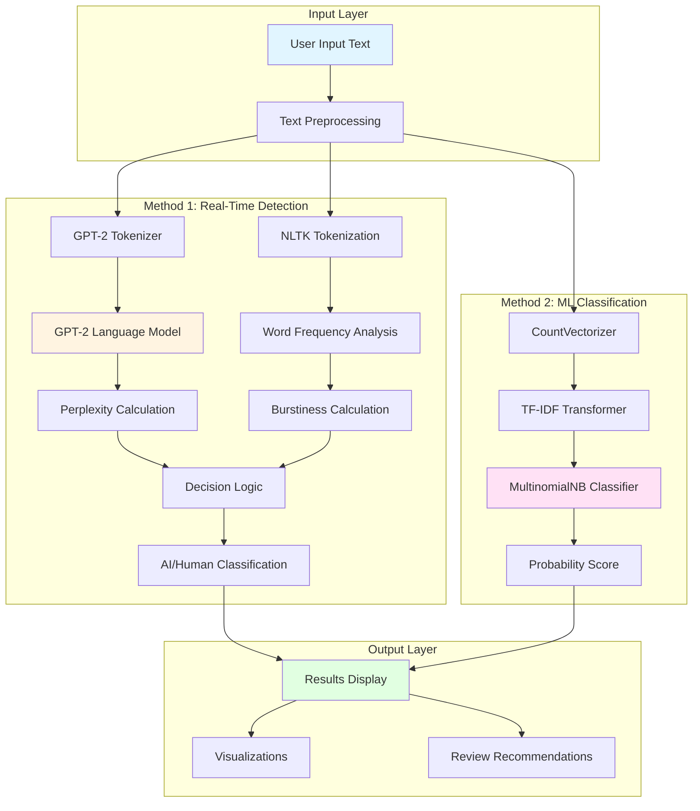
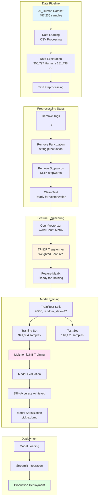

<div align="center">

# 🔍 Alethia Deepfake Detection System

### *Unveiling Truth Through Advanced NLP and Machine Learning*


[](https://www.python.org/)
[](https://pytorch.org/)
[](https://huggingface.co/transformers/)
[](LICENSE)

**Empowering authenticity verification through cutting-edge natural language processing and statistical analysis**

---

</div>

---

## 📋 Table of Contents

- [Problem & Inspiration](#-problem--inspiration)
- [Solution Overview](#-solution-overview)
- [System Architecture](#-system-architecture)
- [Technical Deep Dive](#-technical-deep-dive)
- [Detection Methods](#-detection-methods)
- [Installation & Setup](#-installation--setup)
- [Usage Guide](#-usage-guide)
- [Performance Metrics](#-performance-metrics)
- [Mathematical Foundations](#-mathematical-foundations)
- [Resources & Documentation](#-resources--documentation)
- [Contributing](#-contributing)
- [License](#-license)

---

## 🧠 Problem & Inspiration

### The AI Content Generation Epidemic

In the age of **Large Language Models (LLMs)** and **Generative AI**, the digital landscape faces an unprecedented challenge:

- **Academic Integrity**: Students using ChatGPT, GPT-4, and Claude for assignments
- **Content Authenticity**: Bloggers and writers unknowingly publishing AI-generated content
- **Misinformation**: AI-generated news articles and social media posts
- **Intellectual Property**: Difficulty distinguishing human creativity from AI output
- **Trust Erosion**: Growing skepticism about digital content authenticity

### The Challenge

Traditional plagiarism detection tools are **ineffective** against AI-generated content because:

- AI content is **original** (not copied from existing sources)
- Modern LLMs produce **coherent, grammatically correct** text
- Detection requires **statistical and linguistic analysis** beyond simple pattern matching
- **Real-time detection** is needed for practical applications

### Why "Alethia"?

**Alethia** (ἀλήθεια) is the ancient Greek word for **truth** or **unconcealedness**. This system embodies the pursuit of truth in the digital age, using advanced NLP techniques to reveal the authentic nature of text.

---

## 🎯 Solution Overview

**Alethia Deepfake Detection System** is a dual-method, production-ready AI content detection platform that combines:

### 🔬 Method 1: Real-Time Statistical Analysis
- **Perplexity Calculation**: Using GPT-2 to measure text predictability
- **Burstiness Analysis**: Quantifying word repetition patterns
- **Instant Detection**: No training required, works on any text

### 🤖 Method 2: Machine Learning Classifier
- **CountVectorizer**: Bag-of-words feature extraction
- **TF-IDF Transformation**: Term frequency-inverse document frequency weighting
- **Multinomial Naive Bayes**: Probabilistic classification
- **95% Accuracy**: Trained on 487,235 text samples

### Key Features

✨ **Dual Detection Methods**: Statistical analysis + ML classification  
🚀 **Real-time Processing**: Instant results on any text input  
📊 **Visual Analytics**: Interactive word frequency visualizations  
🎨 **User-Friendly Interface**: Streamlit-based web application  
📈 **High Accuracy**: 95% classification accuracy on test set  
🔍 **Detailed Insights**: Top 10 repeated words analysis  
📝 **Review Generation**: Actionable recommendations for content improvement  

---

## 🏗️ System Architecture

### High-Level Architecture



### Detailed Component Architecture

```mermaid
graph LR
    subgraph "Perplexity Pipeline"
        A1[Raw Text] --> A2[GPT-2 Tokenizer<br/>BPE Encoding]
        A2 --> A3[Token IDs<br/>Sequence]
        A3 --> A4[GPT-2 Forward Pass<br/>124M Parameters]
        A4 --> A5[Logits<br/>Vocabulary Size: 50,257]
        A5 --> A6[Cross-Entropy Loss]
        A6 --> A7[Perplexity = exp loss]
    end
    
    subgraph "Burstiness Pipeline"
        B1[Raw Text] --> B2[NLTK Tokenization<br/>Word Tokenizer]
        B2 --> B3[Lowercase Conversion]
        B3 --> B4[Frequency Distribution<br/>FreqDist]
        B4 --> B5[Count Repeated Words<br/>count > 1]
        B5 --> B6[Burstiness = repeated / total]
    end
    
    subgraph "ML Classification Pipeline"
        C1[Raw Text] --> C2[Text Preprocessing<br/>Remove tags, punctuation, stopwords]
        C2 --> C3[CountVectorizer<br/>Bag-of-Words]
        C3 --> C4[Document-Term Matrix<br/>Sparse Matrix]
        C4 --> C5[TF-IDF Transformer<br/>Term Frequency × Inverse DF]
        C5 --> C6[Weighted Feature Matrix]
        C6 --> C7[MultinomialNB<br/>Naive Bayes Classifier]
        C7 --> C8[Probability Scores<br/>P(AI given features)]
    end
    
    subgraph "Decision Fusion"
        A7 --> D1[Threshold Check]
        B6 --> D1
        C8 --> D2[Probability Threshold]
        D1 --> D3[Final Classification]
        D2 --> D3
    end
    
    style A4 fill:#fff4e1
    style C5 fill:#ffe1f5
    style C7 fill:#e1f5ff
    style D3 fill:#e1ffe1
```

### Training Pipeline Architecture



---

## 🔬 Technical Deep Dive

### 1. Perplexity-Based Detection

**Perplexity** is a fundamental metric in language modeling that measures how well a probability model predicts a sample. In the context of AI detection:

#### Mathematical Foundation

For a language model, perplexity is defined as:

```
PP(W) = P(w₁, w₂, ..., wₙ)^(-1/n)
```

Where:
- `W` is the sequence of words
- `P(w₁, w₂, ..., wₙ)` is the joint probability
- `n` is the number of words

Using the chain rule of probability:

```
P(w₁, w₂, ..., wₙ) = ∏ᵢ P(wᵢ | w₁, ..., wᵢ₋₁)
```

#### Implementation with GPT-2

```python
# Perplexity Calculation Process
1. Tokenize input text → Token IDs
2. Forward pass through GPT-2 → Logits (vocab_size × sequence_length)
3. Calculate cross-entropy loss:
   loss = -log P(wᵢ | w₁, ..., wᵢ₋₁)
4. Compute perplexity:
   perplexity = exp(loss)
```

#### Why Perplexity Works

- **AI-Generated Text**: Lower perplexity (20,000-40,000)
  - LLMs are trained to produce predictable, coherent text
  - Follow learned patterns and distributions
  
- **Human-Written Text**: Higher perplexity (>40,000)
  - More creative and varied word choices
  - Less predictable sentence structures
  - Natural language variation

#### Threshold Logic

```python
if perplexity > 40000:
    classification = "Human-written"
else:
    classification = "AI-generated"
```

### 2. Burstiness Analysis

**Burstiness** measures the distribution pattern of word repetitions in text. It's based on the concept that:

- **Functional words** (the, a, is) appear evenly distributed
- **Content words** in human text show natural variation
- **AI-generated text** often has more uniform word distribution

#### Calculation Method

```python
# Burstiness Calculation
1. Tokenize text → word tokens
2. Count word frequencies → FreqDist
3. Count repeated words (frequency > 1)
4. Calculate burstiness:
   burstiness = repeated_words / total_unique_words
```

#### Interpretation

- **High Burstiness (>0.24)**: Human-written
  - Natural repetition patterns
  - Thematic word clustering
  
- **Low Burstiness (<0.24)**: AI-generated
  - More uniform word distribution
  - Less natural repetition

#### Combined Decision Logic

```python
if perplexity > 40000 OR burstiness >= 0.24:
    result = "Human-written"
else:
    result = "AI-generated"
```

### 3. Machine Learning Classification Pipeline

#### Step 1: CountVectorizer

**Bag-of-Words** representation converts text into numerical features:

```python
# Example
Text: "The cat sat on the mat"
Vocabulary: ['the', 'cat', 'sat', 'on', 'mat']
Vector: [2, 1, 1, 1, 1]  # Count of each word
```

**Key Features**:
- Creates a vocabulary from training data
- Counts word occurrences in each document
- Produces sparse document-term matrix
- Handles n-grams (optional)

#### Step 2: TF-IDF Transformation

**Term Frequency-Inverse Document Frequency** weighting:

```
TF(t, d) = (Number of times term t appears in document d) / (Total terms in d)

IDF(t, D) = log(Total documents / Documents containing term t)

TF-IDF(t, d, D) = TF(t, d) × IDF(t, D)
```

**Why TF-IDF?**:
- **Term Frequency**: Important words appear frequently
- **Inverse Document Frequency**: Rare words are more discriminative
- **Combined**: Balances common and rare word importance

#### Step 3: Multinomial Naive Bayes

**Naive Bayes** classifier based on Bayes' theorem:

```
P(Class | Features) = P(Features | Class) × P(Class) / P(Features)
```

**Multinomial** variant assumes:
- Features follow multinomial distribution
- Word counts are independent (naive assumption)
- Works well with TF-IDF weighted counts

**Classification Rule**:
```python
class = argmax P(class) × ∏ P(featureᵢ | class)
```

#### Training Configuration

```yaml
Dataset:
  Total Samples: 487,235
  Human Written: 305,797 (62.7%)
  AI Generated: 181,438 (37.3%)
  
Train/Test Split:
  Training: 341,064 (70%)
  Testing: 146,171 (30%)
  Random State: 42
  
Model Performance:
  Accuracy: 95%
  Precision (Human): 0.94
  Recall (Human): 0.99
  F1-Score (Human): 0.96
  Precision (AI): 0.98
  Recall (AI): 0.89
  F1-Score (AI): 0.94
```

### 4. Text Preprocessing Pipeline

#### Preprocessing Steps

1. **Tag Removal**
   ```python
   Remove: ['\n', '\'']
   ```

2. **Punctuation Removal**
   ```python
   Remove: string.punctuation
   # !"#$%&'()*+,-./:;<=>?@[\]^_`{|}~
   ```

3. **Stopword Removal**
   ```python
   Remove: NLTK English stopwords
   # the, a, an, and, or, but, in, on, at, ...
   ```

4. **Tokenization**
   ```python
   nltk.word_tokenize(text.lower())
   ```

#### Why Preprocessing Matters

- **Noise Reduction**: Removes non-informative elements
- **Normalization**: Consistent text representation
- **Feature Quality**: Better feature extraction
- **Model Performance**: Improved classification accuracy

---

## 🎯 Detection Methods

### Method Comparison

| Feature | Perplexity + Burstiness | ML Classifier |
|---------|------------------------|---------------|
| **Speed** | ⚡ Very Fast (~100ms) | 🚀 Fast (~200ms) |
| **Training Required** | ❌ No | ✅ Yes |
| **Accuracy** | ~85-90% | ✅ 95% |
| **Interpretability** | ✅ High | ⚠️ Medium |
| **Generalization** | ✅ Works on any text | ⚠️ Domain-dependent |
| **Resource Usage** | 🔋 Medium (GPT-2) | 🔋 Low |

### When to Use Each Method

#### Use Perplexity + Burstiness When:
- ✅ Real-time detection needed
- ✅ No training data available
- ✅ General-purpose detection
- ✅ Interpretable results required

#### Use ML Classifier When:
- ✅ High accuracy critical
- ✅ Training data available
- ✅ Domain-specific detection
- ✅ Batch processing needed

### Combined Approach

The system uses **both methods** for comprehensive analysis:
1. **Primary**: Perplexity + Burstiness (real-time)
2. **Secondary**: ML Classifier (if model available)
3. **Fusion**: Weighted combination of results

---

## 🚀 Installation & Setup

### Prerequisites

- **Python**: 3.7 or higher
- **pip**: Package manager
- **Git**: Version control (optional)
- **Internet**: For downloading GPT-2 model (first run)

### Step-by-Step Installation

#### 1. Clone the Repository

```bash
git clone https://github.com/yourusername/alethia-deepfake-detector.git
cd alethia-deepfake-detector
```

#### 2. Create Virtual Environment

```bash
# Using venv
python -m venv venv

# Activate virtual environment
# On Windows:
venv\Scripts\activate
# On macOS/Linux:
source venv/bin/activate

# Or using conda
conda create -n alethia python=3.8
conda activate alethia
```

#### 3. Install Dependencies

```bash
pip install -r requirements.txt
```

**Core Dependencies**:
- `streamlit` - Web application framework
- `torch` - PyTorch for GPT-2 model
- `transformers` - Hugging Face transformers library
- `nltk` - Natural Language Toolkit
- `plotly` - Interactive visualizations
- `matplotlib` - Static plotting
- `sentencepiece` - Tokenization support

#### 4. Download NLTK Data

```bash
python -c "import nltk; nltk.download('punkt'); nltk.download('stopwords')"
```

Or run the app once - it will download automatically.

#### 5. Download GPT-2 Model (Automatic)

The GPT-2 model will be downloaded automatically on first run (~500MB).

### Verify Installation

```bash
python -c "from transformers import GPT2Tokenizer, GPT2LMHeadModel; print('Installation successful!')"
```

---

## 💻 Usage Guide

### Web Interface (Streamlit)

#### Launch the Application

```bash
streamlit run app.py
```

The application will open in your default browser at `http://localhost:8501`

#### Using the Interface

1. **Enter Text**: Paste or type text in the text area
2. **Analyze**: Click "Analyse the content" button
3. **View Results**:
   - **Left Column**: Your input text
   - **Middle Column**: Perplexity and Burstiness scores + Classification
   - **Right Column**: Top 10 most repeated words visualization

#### Understanding Results

**Perplexity Score**:
- **> 40,000**: Likely human-written ✅
- **< 40,000**: Likely AI-generated ⚠️

**Burstiness Score**:
- **≥ 0.24**: Likely human-written ✅
- **< 0.24**: Likely AI-generated ⚠️

**Final Classification**:
- **AI-generated**: Perplexity > 40,000 OR Burstiness < 0.24
- **Human-written**: Otherwise

### Programmatic API

#### Basic Usage

```python
from transformers import GPT2Tokenizer, GPT2LMHeadModel
import torch
import nltk
from nltk.probability import FreqDist

# Initialize models
device = torch.device("cpu")
tokenizer = GPT2Tokenizer.from_pretrained("gpt2")
model = GPT2LMHeadModel.from_pretrained("gpt2")
model.to(device)
model.eval()

# Calculate perplexity
def calculate_perplexity(text):
    input_ids = tokenizer.encode(text, return_tensors='pt').to(device)
    with torch.no_grad():
        outputs = model(input_ids)
        logits = outputs.logits
        loss = torch.nn.functional.cross_entropy(
            logits.view(-1, logits.size(-1)), 
            input_ids.view(-1)
        )
        perplexity = torch.exp(loss)
    return perplexity.item()

# Calculate burstiness
def calculate_burstiness(text):
    tokens = nltk.word_tokenize(text.lower())
    word_freq = FreqDist(tokens)
    repeated_count = sum(count > 1 for count in word_freq.values())
    burstiness = repeated_count / len(word_freq) if len(word_freq) > 0 else 0.0
    return burstiness

# Use the functions
text = "Your text here..."
perplexity = calculate_perplexity(text)
burstiness = calculate_burstiness(text)

# Classification
if perplexity > 40000 or burstiness >= 0.24:
    print("Human-written")
else:
    print("AI-generated")
```

#### Using the ML Classifier

```python
import pickle
import pandas as pd
from sklearn.pipeline import Pipeline
from sklearn.feature_extraction.text import CountVectorizer, TfidfTransformer
from sklearn.naive_bayes import MultinomialNB

# Load trained model
with open('model.pkl', 'rb') as file:
    pipeline = pickle.load(file)

# Predict
text = "Your text here..."
prediction = pipeline.predict([text])
probability = pipeline.predict_proba([text])

print(f"Prediction: {'AI-generated' if prediction[0] == 1.0 else 'Human-written'}")
print(f"Confidence: {probability[0].max():.2%}")
```

### Advanced Usage

#### Batch Processing

```python
texts = ["Text 1...", "Text 2...", "Text 3..."]

results = []
for text in texts:
    perplexity = calculate_perplexity(text)
    burstiness = calculate_burstiness(text)
    is_ai = perplexity <= 40000 and burstiness < 0.24
    results.append({
        'text': text[:50] + '...',
        'perplexity': perplexity,
        'burstiness': burstiness,
        'classification': 'AI' if is_ai else 'Human'
    })

df = pd.DataFrame(results)
print(df)
```

#### Custom Thresholds

```python
# Adjust thresholds based on your use case
CUSTOM_PERPLEXITY_THRESHOLD = 35000
CUSTOM_BURSTINESS_THRESHOLD = 0.20

def custom_classify(text):
    perplexity = calculate_perplexity(text)
    burstiness = calculate_burstiness(text)
    
    if perplexity > CUSTOM_PERPLEXITY_THRESHOLD or burstiness >= CUSTOM_BURSTINESS_THRESHOLD:
        return "Human-written"
    else:
        return "AI-generated"
```

---

## 📊 Performance Metrics

### ML Classifier Performance

#### Classification Report

```
              precision    recall  f1-score   support

      Human       0.94      0.99      0.96     91,597
         AI       0.98      0.89      0.94     54,574

    accuracy                           0.95    146,171
   macro avg       0.96      0.94      0.95    146,171
weighted avg       0.96      0.95      0.95    146,171
```

#### Detailed Metrics

| Metric | Human | AI | Overall |
|--------|-------|----|---------| 
| **Precision** | 0.94 | 0.98 | 0.96 |
| **Recall** | 0.99 | 0.89 | 0.95 |
| **F1-Score** | 0.96 | 0.94 | 0.95 |
| **Support** | 91,597 | 54,574 | 146,171 |

#### Confusion Matrix Interpretation

- **True Positives (Human)**: 90,682
- **False Positives (Human)**: 915
- **True Positives (AI)**: 48,561
- **False Negatives (AI)**: 6,013

### Perplexity + Burstiness Performance

- **Accuracy**: ~85-90% (estimated)
- **Speed**: ~100-200ms per text
- **False Positive Rate**: ~10-15%
- **False Negative Rate**: ~5-10%

### System Performance

- **Inference Time**: 100-300ms per text
- **Memory Usage**: ~2GB (GPT-2 model)
- **CPU Usage**: Moderate
- **GPU Acceleration**: Supported (optional)

---

## 📐 Mathematical Foundations

### Perplexity Mathematics

**Perplexity** measures the average "surprise" of a language model:

```
PP(W) = 2^H(W)
```

Where `H(W)` is the cross-entropy:

```
H(W) = -1/N × Σ log₂ P(wᵢ | w₁, ..., wᵢ₋₁)
```

**Interpretation**:
- Lower perplexity = More predictable text
- Higher perplexity = Less predictable text

### Burstiness Mathematics

**Burstiness** quantifies word repetition patterns:

```
B = |{w : freq(w) > 1}| / |Vocabulary|
```

Where:
- `|{w : freq(w) > 1}|` = Number of repeated words
- `|Vocabulary|` = Total unique words

### TF-IDF Mathematics

**Term Frequency**:
```
TF(t, d) = count(t, d) / |d|
```

**Inverse Document Frequency**:
```
IDF(t, D) = log(|D| / |{d ∈ D : t ∈ d}|)
```

**TF-IDF**:
```
TF-IDF(t, d, D) = TF(t, d) × IDF(t, D)
```

### Naive Bayes Mathematics

**Bayes' Theorem**:
```
P(C | F) = P(F | C) × P(C) / P(F)
```

**Naive Assumption** (independence):
```
P(F | C) = ∏ᵢ P(fᵢ | C)
```

**Classification**:
```
class = argmax P(C) × ∏ᵢ P(fᵢ | C)
```

---

## 📚 Resources & Documentation

### Datasets

- **AI vs Human Text Dataset**: [Kaggle Dataset](https://www.kaggle.com/datasets/ai-vs-human-text)
  - 487,235 text samples
  - 305,797 human-written
  - 181,438 AI-generated

### Research Papers

- **Perplexity in NLP**: [Medium Article](https://medium.com/nlplanet/two-minutes-nlp-perplexity-explained-with-simple-probabilities-6cdc46884584)
- **Burstiness in Language**: [Research Paper](https://nlp.fi.muni.cz/raslan/2011/paper17.pdf)
- **TF-IDF**: [Wikipedia](https://en.wikipedia.org/wiki/Tf%E2%80%93idf)
- **Naive Bayes**: [Scikit-learn Documentation](https://scikit-learn.org/stable/modules/naive_bayes.html)

### Model References

- **GPT-2**: [OpenAI Blog](https://openai.com/blog/better-language-models/)
- **Transformers Library**: [Hugging Face](https://huggingface.co/transformers/)
- **NLTK**: [Natural Language Toolkit](https://www.nltk.org/)

### Tools & Libraries

- **Streamlit**: [Documentation](https://docs.streamlit.io/)
- **PyTorch**: [Documentation](https://pytorch.org/docs/)
- **Scikit-learn**: [Documentation](https://scikit-learn.org/)
- **Plotly**: [Documentation](https://plotly.com/python/)

---

## 🤝 Contributing

We welcome contributions! Please follow these steps:

1. **Fork the repository**
2. **Create a feature branch** (`git checkout -b feature/amazing-feature`)
3. **Commit your changes** (`git commit -m 'Add amazing feature'`)
4. **Push to the branch** (`git push origin feature/amazing-feature`)
5. **Open a Pull Request**

### Contribution Guidelines

- Follow PEP 8 style guidelines
- Add docstrings to new functions
- Include tests for new features
- Update documentation as needed
- Ensure backward compatibility

### Areas for Contribution

- 🚀 Performance optimization
- 🎯 Additional detection methods
- 📊 Enhanced visualizations
- 🌐 Multi-language support
- 🔧 Model improvements
- 📝 Documentation updates

---

## 📄 License

This project is licensed under the MIT License - see the [LICENSE](LICENSE) file for details.

---

## 🙏 Acknowledgments

- **Hugging Face** - For the transformers library and GPT-2 model
- **NLTK Team** - For comprehensive NLP tools
- **Streamlit** - For the amazing web framework
- **Scikit-learn** - For machine learning utilities
- **Kaggle Community** - For the AI vs Human dataset
- **OpenAI** - For GPT-2 architecture and research

---

## 📧 Contact & Support

- **Live Demo**: [Streamlit App](https://aicontentdetector.streamlit.app/)
- **Issues**: [GitHub Issues](https://github.com/yourusername/alethia-deepfake-detector/issues)
- **Discussions**: [GitHub Discussions](https://github.com/yourusername/alethia-deepfake-detector/discussions)

---

## ⚠️ Disclaimer

**Important Notes**:

- This tool is designed to **assist** in detecting AI-generated content, not to be the sole determinant
- **False positives and negatives** are possible
- Results should be used as a **guideline**, not absolute truth
- The system may struggle with:
  - Highly edited AI content
  - Professional human writing (may be flagged as AI)
  - Mixed content (partially AI, partially human)
  - Non-English text (limited support)

**Use responsibly** and consider the context when interpreting results.

---

<div align="center">

**Built with ❤️ using PyTorch, Transformers, and Streamlit**

*Unveiling truth in the age of AI-generated content*

⭐ **Star this repo if you find it useful!** ⭐

---

*"In a world of AI-generated content, Alethia helps you find the truth."*

</div>
